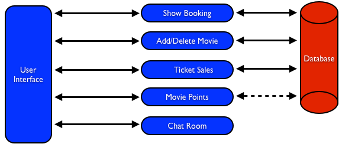
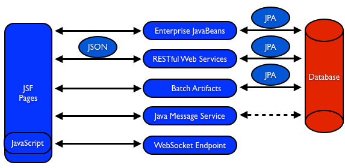
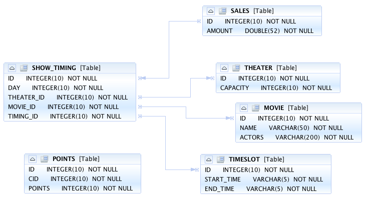

# Java EE 7 Hands-on Lab with GlassFish 4
The Java EE 7 platform continues the ease of development push that characterized prior releases by bringing further simplification to enterprise development. It adds new and important APIs such as the REST client API in JAX-RS 2.0 and the long awaited Batch Processing API. Java Message Service 2.0 has undergone an extreme makeover to align with the improvements in the Java language. There are plenty of improvements to several other components. Newer web standards like HTML 5, WebSocket, and JSON processing are embraced to build modern web applications.

This hands-on lab will build a typical 3-tier end-to-end application using the
following Java EE 7 technologies:

* Java Persistence API 2.1 ([JSR 338](http://jcp.org/en/jsr/detail?id=338))
* Java API for RESTful Web Services 2.0 ([JSR 339](http://jcp.org/en/jsr/detail?id=339))
* Java Message Service 2.0 ([JSR 343](http://jcp.org/en/jsr/detail?id=343))
* JavaServer Faces 2.2 ([JSR 344](http://jcp.org/en/jsr/detail?id=344))
* Contexts and Dependency Injection 1.1 ([JSR 346](http://jcp.org/en/jsr/detail?id=346))
* Bean Validation 1.1 ([JSR 349](http://jcp.org/en/jsr/detail?id=349))
* Batch Applications for the Java Platform 1.0 ([JSR 352](http://jcp.org/en/jsr/detail?id=352))
* Java API for JSON Processing 1.0 ([JSR 353](http://jcp.org/en/jsr/detail?id=353))
* Java API for WebSocket 1.0 ([JSR 356](http://jcp.org/en/jsr/detail?id=356))
* Java Transaction API 1.2 ([JSR 907](http://jcp.org/en/jsr/detail?id=907))

Together these APIs will allow you to be more productive by simplifying enterprise development.

### Author
[Arun Gupta](http://blogs.oracle.com/arungupta), Java EE & GlassFish Guy || [@arungupta](http://twitter.com/arungupta)

## Table of Contents
1. Software Requirement
2. Problem Statement
    1. Lab Flow
3. Walk-­‐through of Sample Application
4. Show	Booking (JavaServer Faces)
5. Chat Room (Java API for WebSocket)  
6. View and Delete Movie (Java API for RESTful Web Services)
7. Add Movie (Java API for JSON Processing)
8. Ticket Sales (Batch Applications for the Java Platform)
9. Movie Points (Java Message Service 2)
10. Conclusion	
11. Troubleshooting

## 1. Software Requirement	
The following software needs to be downloaded and installed:
* [Java JDK 7](http://www.oracle.com/technetwork/java/javase/downloads/index.html)
* [NetBeans 7.3](http://netbeans.org/downloads/) (*All* or *Java EE* version)
* [GlassFish 4.0 b89](http://dlc.sun.com.edgesuite.net/glassfish/4.0/promoted/glassfish-4.0-
b87.zip)

Configure GlassFish 4 in NetBeans IDE following the instructions in Appendix A.

## 2. Problem Statement	
This hands-on lab builds a typical 3-tier Java EE 7 Web application that allows customers to view the show timings for a movie in a 7-theater cineplex and make reservations. Users can add new movies and delete existing movies. Customers can discuss the movie in a chat room. Total sales from each howing are calculated at the end of the day. Customers also accrue points for watching movies.

**Figure 2 - Application flow**

*Figure 2* shows the key components of the application. The User Interface initiates all the flows in the application. Show Booking, Add/Delete Movie and Ticket Sales interact with the database; Movie Points may interact with the database, however, this is out of scope for this application; and Chat Room does not interact with the database.

The different functions of the application, as detailed above, utilize various Java technologies and web standards in their implementation. *Figure 3* shows how different Java EE technologies are used in different flows.

**Figure 2 - Technologies Used in the Application**

<b>Flow</b>             | <b>Description</b>
-----------------|---------------------------------------------------------
User Interface   | Written entirely in JavaServer Faces (JSF).
-----------------|---------------------------------------------------------
Show Booking     | Uses lightweight Enterprise JavaBeans to 
                 | communicate with the database using Java Persistence API
-----------------|---------------------------------------------------------
Add/Delete Movie | Implemented using RESTful Web Services. JSON is used as 
                 | on-the-wire data format.
-----------------|---------------------------------------------------------
Ticket Sales     | Uses Batch Applications for the Java Platform to calculate 
                 | the total sales and persist to the database.
-----------------|---------------------------------------------------------
Movie Points     | Uses Java Message Service (JMS) to update and obtain 
                 | loyalty reward points; an optional implementation using 
                 | database technology may be performed.
-----------------|---------------------------------------------------------
Chat Room        | Utilizes client-side JavaScript and JSON to communicate 
                 | with a WebSocket endpoint

**Table 1 - Technologies Used in the Application**

## 2.1. Lab Flow	
The attendees will start with an existing maven application and by following the instructions and guidance provided by this lab they will:

* Read existing source code to gain an understanding of the structure of the application and use of the selected platform technologies
* Add new and update existing code with provided fragments in order to demonstrate usage of different technology stacks in the Java EE 7 platform.

This is not a comprehensive tutorial of Java EE. The attendees are expected to know the basic Java EE concepts such as EJB, JPA, JAX-RS, and CDI. The Java EE 6 Tutorial is a good place to learn all these concepts. However enough explanation is provided in this guide to get you started with the application.

### Disclaimer
This is a sample application and the code may not be following the best practices to prevent SQL injection, cross-side scripting attacks, escaping parameters, and other similar features expected of a robust enterprise application. This is intentional such as to stay focused on explaining the technology. It is highly recommended to make sure that the code copied from this sample application is updated to meet those requirements.

## 3. Walk­‐through of Sample Application

### Purpose
This section will download the sample application to be used in this hands-on lab. A walk-through of the application will be performed to provide an understanding of the application architecture.

#### 3.1. Git clone the [Java EE 7 Hands On repository](http://github.com/glassfish/javaee7hol) on GitHub. 
This repository comes with a starting code application named <code>movieplex7</code>.

<code>$ git clone git@github.com:glassfish/javaee7hol.git</code>

#### 3.2. Open Project In NetBeans IDE
Select *File > Open Project...*, select the movieplex7 directory, and click on *Open Project*. The project structure is shown in *Figure 4*.

##### Attention
While opening the project, NetBeans may prompt you to create a configuration file to configure the base URI of the REST resources bundled in the application. The application already contains a source file that provides the needed configuration. Click on *Cancel* to dismiss this dialog.

#### 3.3. Maven Coordinates
Expand *Project Files* and double click on <code>pom.xml</code>. In the pom.xml, the Java EE 7 API is specified as a <code>&lt;dependency&gt;</code>:

<pre><code>&lt;dependencies&gt;
   &lt;dependency&gt;
     &lt;groupId&gt;javax&lt;/groupId&gt;
     &lt;artifactId&gt;javaee-api&lt;/artifactId&gt;
     &lt;version&gt;7.0-b87&lt;/version&gt;
   &lt;/dependency&gt;
&lt;dependencies&gt;</code></pre>

This will ensure that Java EE 7 APIs are retrieved from Maven. Notice, a specific version number is specified and this must be used with the downloaded GlassFish 4.0 build. 

The Java EE 6 platform introduced the notion of “profiles”. A profile is a configuration of the Java EE platform targeted at a specific class of applications. All Java EE profiles share a set of common features, such as naming and resource
injection, packaging rules, security requirements, etc. A profile may contain a proper subset or superset of the technologies contained in the platform.

The Java EE Web Profile is a profile of the JavaEE Platform specifically targeted at modern web applications. The complete set of specifications defined in the Web Profile is defined in the Java EE 7 Web Profile Specification. GlassFish can be downloaded in two different flavors – Full Platform or Web Profile.

This lab requires Full Platform download. All technologies used in this lab, except Java Message Service and Batch Applications for the Java Platform, can be deployed on Web Profile.

#### 3.4 Default Data Source
Expand “Other Sources”, <code>src/main/resources</code>, <code>META-INF</code>, and double-click on <code>persistence.xml</code>. By default, NetBeans opens the file in Design View. Click on Source tab to view the XML source.	

It looks like:

<pre><code>&lt;?xml version="1.0" encoding="UTF-8"?&gt;
&lt;persistence version="2.0"
   xmlns="http://java.sun.com/xml/ns/persistence"
   xmlns:xsi="http://www.w3.org/2001/XMLSchema-instance"
   xsi:schemaLocation="http://java.sun.com/xml/ns/persistence 
                       http://java.sun.com/xml/ns/persistence/persistence_2_0.xsd"&gt;
   &lt;persistence-unit name="movieplex7PU" transaction-type="JTA"&gt;
     &lt;!--
     &lt;jta-data-source&gt;java:comp/DefaultDataSource&lt;/jta-data-source&gt;
     --&gt;
     &lt;properties&gt;
       &lt;property name="javax.persistence.schema-generation.database.action"
                 value="drop-and-create"/&gt;
       &lt;property name="javax.persistence.schema-generation.create-source"
                 value="script"/&gt;
       &lt;property name="javax.persistence.schema-generation.create-script-source"
                 value="META-INF/create.sql"/&gt;
       &lt;property n ame="javax.persistence.sql-load-script-source"
                value="META-INF/load.sql"/&gt;
       &lt;property name="eclipselink.deploy-on-startup"
                 value="true"/&gt;
       &lt;property name="eclipselink.logging.exceptions"
                 value="false"/&gt;
     &lt;/properties&gt;
   &lt;/persistence-unit&gt;
&lt;/persistence&gt;</code></pre>

Notice <code>&lt;jta-data-source&gt;</code> is commented out, i.e. no data source element is specified. This element identifies the JDBC resource to connect to in the runtime environment of the underlying application server.

The Java EE 7 platform defines a new default DataSource that must be provided by the runtime. This pre-configured data source is accessible under the JNDI name:

<code>java:comp/DefaultDataSource</code>

The JPA 2.1 specification says if neither <code>jta-data-source</code> nor <code>non-jta-data-source</code> elements are specified, the deployer must specify a JTA data source or the default JTA data source must be provided by the container. For GlassFish 4, the default data source is bound to the JDBC resource <code>jdbc/__default</code>. Clicking back and forth between “Design” and “Source” view may prompt the error shown below:

This will get resolved when we run the application. Click on “OK” to dismiss the dialog.

#### 3.5 Schema Generation
JPA 2.1 defines a new set of <code>javax.persistence.schema-generation.*</code> properties that can be used to
generate database artifacts like tables, indexes, and constraints in a database
schema. This helps in prototyping of your application where the required artifacts
are generated either prior to application deployment or as part of
<code>EntityManagerFactory</code> creation. This feature will allow your JPA domain
object model to be directly generated in a database. The generated schema may
need to be tuned for actual production environment.
The <code>persistence.xml</code> in the application has the following
<code>javax.persistence.schema-generation.*</code> properties. Their meaning and
possible values are explained in Table 2.

<pre><code><b>Property</b>                     | <b>Meaning</b>                      | <b>Values</b>
-----------------------------|------------------------------|---------------------
javax.persistence.schema-    | Specifies the action to be   | "none", "create",
generation.database.action   | taken by the persistence     | "drop-and-create",
                             | provider with regard to      | "drop”
-----------------------------|------------------------------|---------------------
javax.persistence.schema-    | Specifies whether the        | "metadata”, "script",
generation.create-source     | creation of database         | "metadata-then-
                             | artifacts is to occur on     | script”, “script-
                             | the basis of the             | then-metadata”
                             | object/relational mapping    | 
                             | metadata, DDL script, or     | 
                             | a combination of the two.    | 
-----------------------------|------------------------------|---------------------
javax.persistence.schema-    | Specifies a java.IO.Reader   |
generation.create-script-    | configured for reading of    |
source                       | the DDL script or a string   |
                             | designating a file URL       |
                             | for the DDL script           |
-----------------------------|------------------------------|---------------------
javax.persistence.sql-load-  | Specifies a java.IO.Reader   |
script-source                | configured for reading of the|
                             | SQL load script for database |
                             | initialization or a string   |
                             | designating a file URL for   |
                             | the script.                  |
-----------------------------|------------------------------|---------------------
</code></pre>

Refer to the [JPA 2.1 Specification](http://jcp.org/en/jsr/detail?id=338) for a complete understanding of these properties.

In the application, the scripts are bundled in the WAR file in <code>META-INF</code> directory. As the location of these scripts is specified as a URL, the scripts may be loaded from outside the WAR file as well.

Feel free to open <code>create.sql</code> and <code>load.sql</code> and read through the SQL scripts. The database schema is shown in Figure 7.

**Figure 6 - Database Schema**

This folder also contains <code>sales.csv</code> which carries some comma-separated data used later in the application.

#### 3.6. JPA Entities, Stateless EJBs, and REST endpoints
Expand *Source Packages*. The package <code>org.glassfish.movieplex7.entities</code> contains the JPA entities corresponding to the database table definitions. Each JPA entity has several convenient @NamedQuery defined and uses Bean Validation constraints
to enforce validation. 

The package <code>org.glassfish.movieplex7.rest</code> contains stateless EJBs corresponding to different JPA entities.

Each EJB has methods to perform CRUD operations on the JPA entity and convenience query methods. Each EJB is also EL-injectable (<code>@Named</code>) and published as a REST endpoint (<code>@Path</code>). The <code>AplicationConfig</code> class defines the base path of REST endpoint. The path for the REST endpoint is the same as the JPA entity class name. 

The mapping between JPA entity classes, EJB classes, and the URI of the corresponding REST endpoint is shown in Table 3.